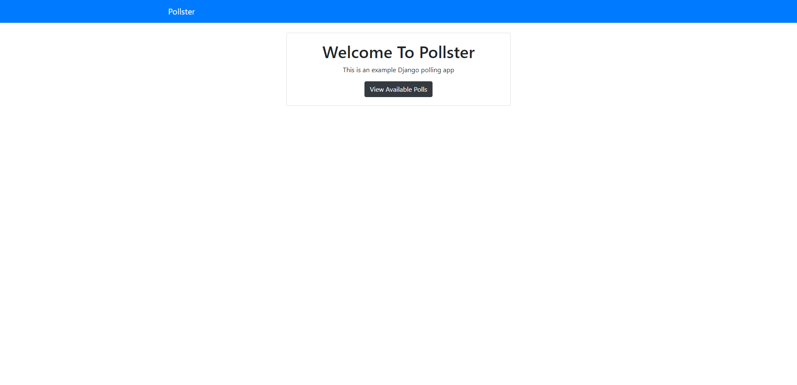
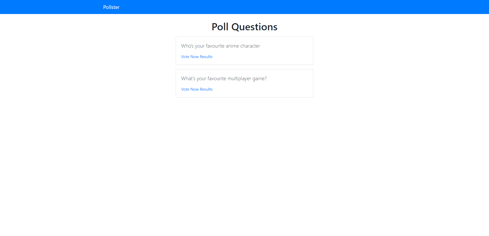
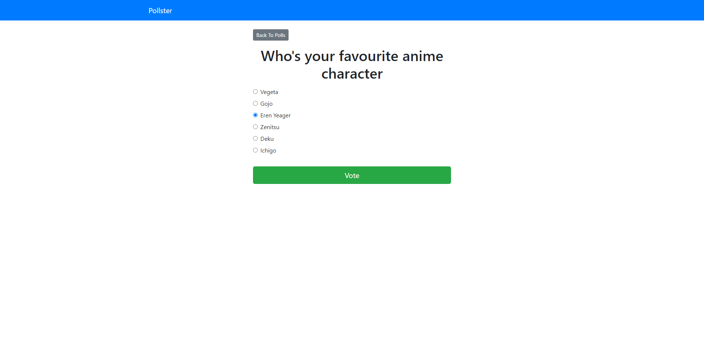
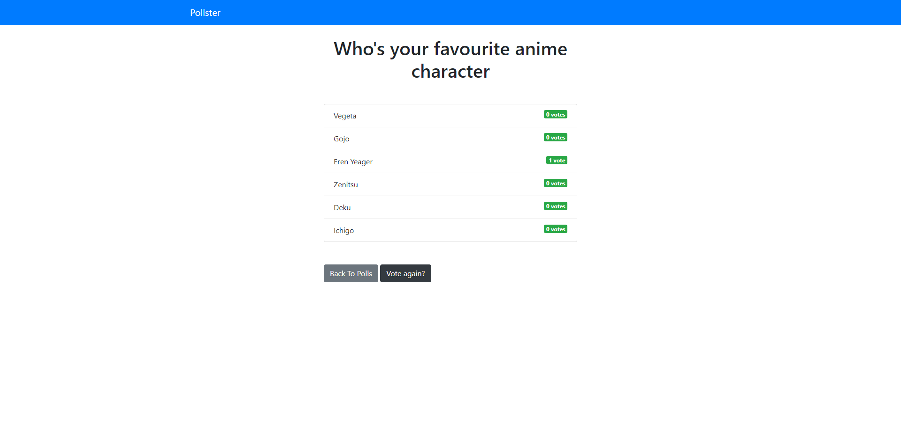
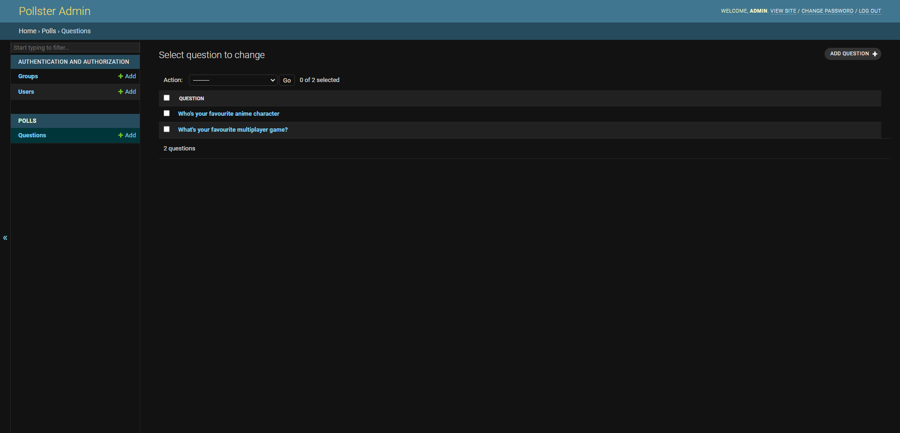

## Project Overview
This is a simple polls website built using the Django web framework. The website allows users to create, vote, and view polls. Each poll can have multiple choices, and users can select their preferred choice to vote.

## Features
* Create new polls with multiple choices.
* Vote for a choice in a poll.
* View the results of a poll.
* See a list of all polls.

## Prerequisites
Before running the polls website, make sure you have the following installed:

* Python (version 3.6 or later)
* Django (version 3.0 or later)

## Installation
1. Clone the repository or download the source code.
```bash
git clone https://github.com/silentwraith03/pollster-project.git
```
2. Navigate to the project directory.
```bash
cd pollster-project
```
3. Install the required dependencies.
```bash
pip install -r requirements.txt
```
4. Create the database and apply the migrations.
```bash
python manage.py migrate

```

## Project Structure
```arduino
polls-website/
  |- polls/
  |  |- migrations/
  |  |- static/
  |  |- templates/
  |  |- admin.py
  |  |- apps.py
  |  |- models.py
  |  |- urls.py
  |  |- views.py
  |- manage.py
  |- README.md
  |- requirements.txt
```

## Screenshots






## Tech Used
* Python
* Django
* HTML
* CSS
* JavaScript
* SQLite

## License
[MIT](LICENSE)